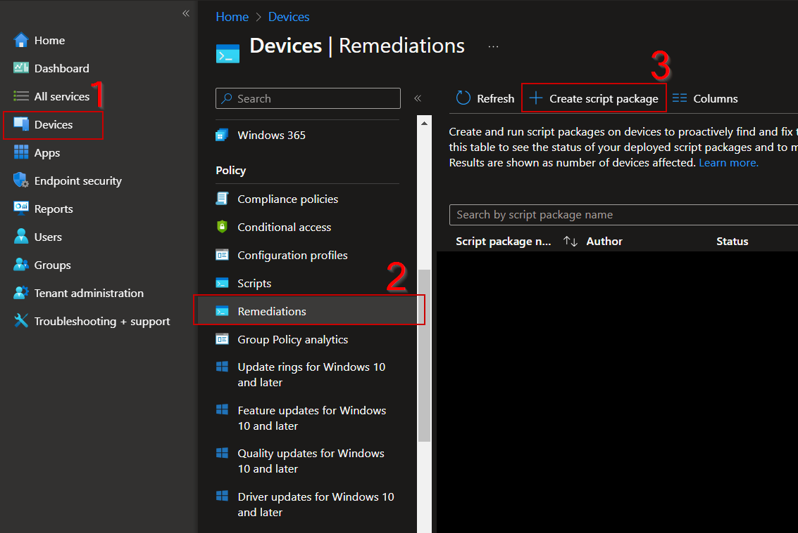
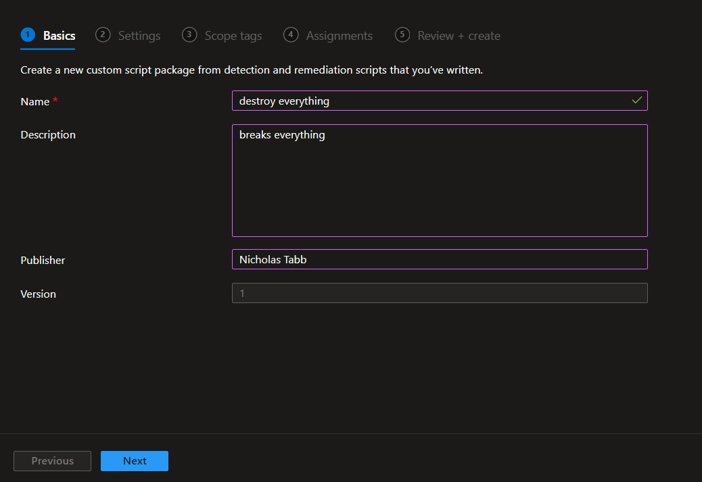
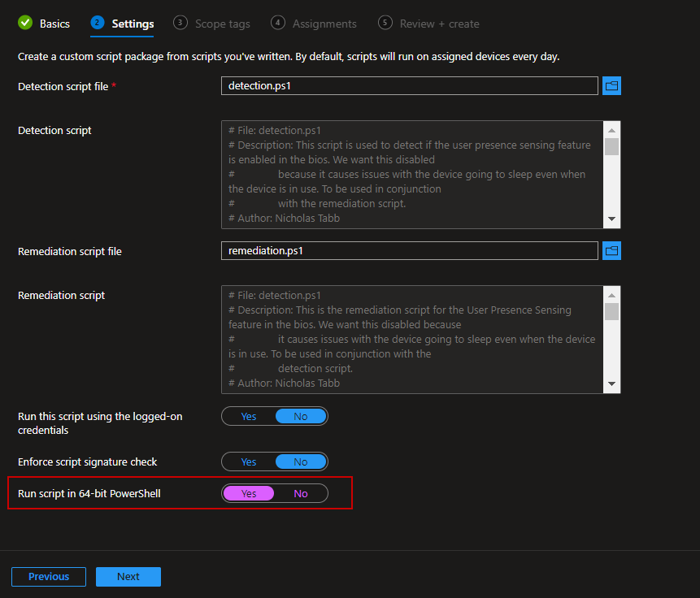
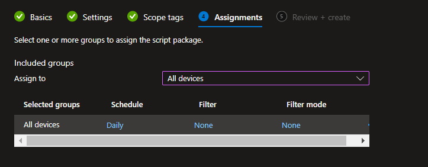

# Endpoint Management Scripts

[![LinkedIn][linkedin-shield]][linkedin-url]
[![MIT License][license-shield]][license-url]

## About
This repository is a collection of PowerShell scripts for Intune remediations and SCCM configuration baselines. It mainly consists of the more commonly used ones in my work as a systems administrator.

## Getting Started
To get a local copy up and running, follow these simple steps.

### Prerequisites
None.

### Installation
1. Clone the repo

## Usage
1. Open the [Intune Portal](https://intune.microsoft.com/).

2. Navigate to <b>Devices > Remediations</b>. Click the <b>Create script package</b> button.

3. Name the script and give it a description that describes its usage.

4. Add the detection and remediation scripts. Make sure you select to run in the 64-bit version of PowerShell.

5. Assign the necessary scope. For this example, I will skip over it.

6. Assign the necessary groups. Again, I will select none. Additionally, you can assign the schedule at which the remediation runs on devices.

## Contributing
Contributions are what make the open-source community such an amazing place to learn, inspire, and create. Any contributions you make are greatly appreciated.

1. Fork the Project
2. Create your Feature Branch (`git checkout -b feature/AmazingFeature`)
3. Commit your Changes (`git commit -m 'Add some AmazingFeature'`)
4. Push to the Branch (`git push origin feature/AmazingFeature`)
5. Open a Pull Request

## License
Distributed under the MIT License. See `LICENSE` for more information.

## Contact
Nicholas Tabb [thechiefnick](https://www.discord.com) - admin@chiefnick.com

Project Link: [https://github.com/elliepup/endpoint-management-scripts](https://github.com/elliepup/endpoint-management-scripts)

[license-shield]: https://img.shields.io/github/license/elliepup/endpoint-management-scripts.svg?style=for-the-badge
[license-url]: https://github.com/elliepup/endpoint-management-scripts/blob/main/LICENSE
[linkedin-shield]: https://img.shields.io/badge/-LinkedIn-black.svg?style=for-the-badge&logo=linkedin&colorB=555
[linkedin-url]: https://www.linkedin.com/in/nicholas-tabb-30800b232